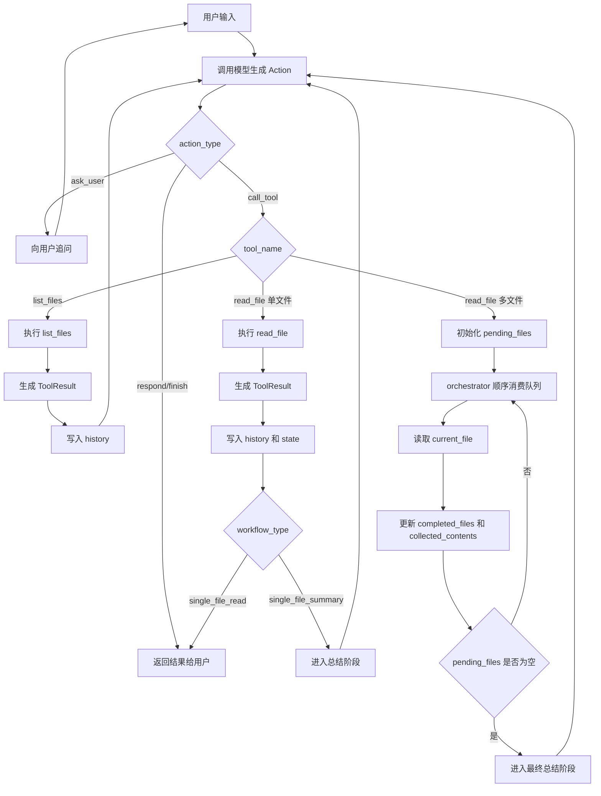

# File Workflow Agent

## 项目简介
这是一个本地文件 Agent Demo，目标不是做模型训练，而是验证 AI Agent 工程中的核心问题：如何把“最小 Agent 闭环”升级成“带最小任务队列的 Workflow Agent”。

项目当前聚焦于本地文件场景，支持：
- 单文件读取
- 单文件总结
- 多文件总结

这个项目的重点不是单纯调用大模型和工具，而是把模型能力放进一个可控的工程系统里。

## 项目目标
这个版本重点验证下面几件事：
- 模型决策与工具执行如何形成闭环
- `history` 和 `state` 如何分层
- 多文件任务如何从模型记忆转成程序控制
- workflow 如何处理阶段推进、失败分流和最终总结

## 核心设计
系统采用“模型负责语义识别，程序负责流程控制”的分工：
- 模型输出 `Action`
- orchestrator 执行工具，得到 `ToolResult`
- 工具结果写入 `history`，供模型继续理解
- workflow 相关状态落在 `state` 中，由程序推进

在这个设计里：
- `task_type` 表示模型识别出的任务类型
- `workflow_type` 表示程序当前实际处于哪个流程状态

## 核心数据结构
- `Action`：模型输出的下一步动作
- `ToolResult`：工具执行后的结果
- `history`：给模型看的语义上下文
- `state`：给程序控制流程的结构化上下文
- `task_type`：模型识别出的任务类型
- `workflow_type`：程序维护的流程状态

多文件 workflow 依赖下面几个关键字段：
- `pending_files`
- `completed_files`
- `collected_contents`
- `current_file`

## Workflow 设计
当前版本支持三类 workflow：
- `single_file_read`
- `single_file_summary`
- `multi_file_summary`

多文件场景下，系统流程如下：
1. 模型识别出任务目标和文件列表。
2. orchestrator 将文件列表落到 `pending_files`。
3. 程序顺序消费文件队列，逐个调用 `read_file`。
4. 成功读取的结果写入 `collected_contents`。
5. 当所有文件读取完成后，进入最终总结阶段。
6. 最终总结以 `collected_contents` 为主数据源。

## 流程图

## 运行方式
1. 配置 `config.yaml`
2. 启动 `app.py`
3. 输入读取或总结请求

## 当前能力
- 单文件读取
- 单文件总结
- 多文件总结
- 基于 `task_type + workflow_type` 的最小 workflow 控制
- 基于 state 的多文件任务队列推进

## 已知限制
- `ask_user` 之后恢复原 workflow 的能力还不完整
- 错误分类和恢复策略仍然较简化
- 当前主要是 CLI 版本，尚未服务化

## 下一步计划
- 完善 human-in-the-loop 的恢复能力
- 增加日志和可观测性
- 增加测试
- 提供 FastAPI 接口
- 在稳定 workflow 底座上再考虑接入 RAG / MCP
