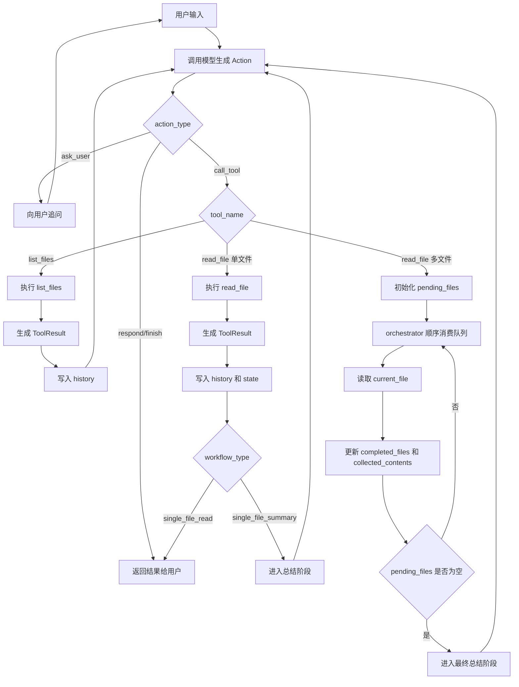

# WorkflowAgentV2 流程图

## 主流程说明
下面这张图描述了 `workFlowAgentV2` 的主执行流程，重点体现：
- 模型负责输出 `Action` 和 `task_type`
- orchestrator 负责维护 `workflow_type` 和状态推进
- 多文件任务由程序顺序消费队列
- 总结类任务会在读取完成后进入最终总结阶段

## Mermaid

## 阶段理解
- `single_file_read`：读取完成即可直接返回结果。
- `single_file_summary`：读取完成后还需要进入总结阶段。
- `multi_file_summary`：所有文件读取完成后，基于 `collected_contents` 进入最终总结阶段。
